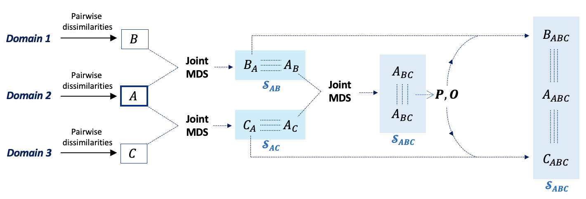

# Joint-Representation-Learning-Oncology-Applications

This repository employs the unsupervised manifold alignment method, Joint Multidimensional Scaling (Joint MDS, https://arxiv.org/abs/2207.02968) to explore its novel application to heterogeneous data modalities, namely radiomic features from magnetic resonance imaging (MRI) with transcriptomic, epigenomic, and copy number variation (CNV) data from patients with glioblastoma multiforme (GBM) and  lower-grade gliomas (LGG).

We also further present a successful extension of the method, Joint MDS3, that extends the functionality of Joint MDS to support three data modalities.

## Joint MDS3 - Extension of Joint MDS
We extended the Joint MDS algorithm to integrate datasets from three domains, introducing **Joint MDS3**. 

Joint MDS3 extends the original Joint MDS algorithm to integrate datasets from three domains (A, B, and C). The basic overview of how this works is:
1. **Core Dataset Selection**: One dataset (A, B, or C) is chosen as the core, typically based on prior literature, and serves as the reference point. For example, let A be the core dataset.
2. **Pairwise Alignment**: Align datasets B and C to the core dataset (A), producing low-dimensional embeddings (BA and CA) and two embeddings for A (AB and AC).
3. **Joint MDS on Embeddings**: Apply Joint MDS to the embeddings AB and AC to find a common subspace that aligns with all three domains, resulting in ABC.
4. **Final Alignment**: Use a transportation cost matrix (P) and orthogonal transformation (O) from AB and AC alignment to transform BA and CA, producing BAC and CAB.

The method results in low-dimensional embeddings (ABC, BAC, CAB) that reside in a common subspace across all three domains.

## Key Features
- **Multi-modal Data Integration**: Integrates MRI radiomic features with genomic, transcriptomic, and copy number variant (CNV) data.
- **Improved Accuracy**: Achieves superior performance compared to baseline models like UnionCom and SCOT, with a 73.5% average label transfer accuracy.
- **Reduced Incorrect Matches**: Decreases the fraction of samples incorrectly matched to 50% or less.
- **Extended Framework**: Joint MDS3 supports the alignment of three data modalities

## Data Availability 
- Sequencing data was obtained from The Cancer Genome Atlas (TCGA) - publicly available
- MRIs were obtained from the 2023 Brain Tumour Segmentation Challenge

## Acknowledgments
This work was supported by the Swiss National Science Foundation (TMSGI3_225913) and the Basel Research Center for Child Health Postdoctoral Excellence Fellowship (#PEP-2021-1008). Computational data analysis was performed on the ETH Zürich Euler computing cluster (https://sis.id.ethz.ch/services/hpc/)

